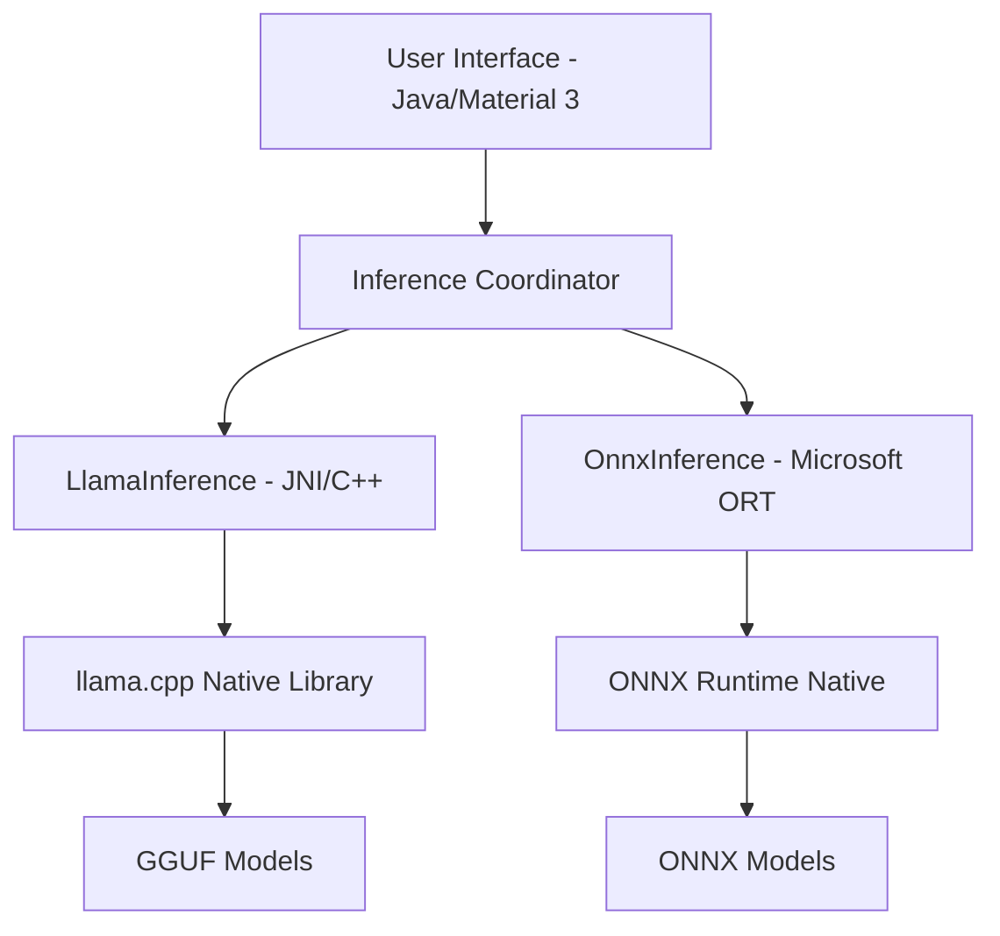

# Technical Architecture

RAY AI is designed with a hybrid architecture that combines a high-level Java Android framework with low-level C++ inference engines. This design ensures both ease of UI development and maximum performance for AI tasks.

## 🏗 High-Level Architecture

## 🔌 Native Integration (JNI)

The core of the offline inference is powered by `llama.cpp`. The integration is handled through a Java Native Interface (JNI) bridge.

### JNI Layer
The JNI layer resides in `android/app/src/main/cpp/`. It acts as a translator between Java strings/objects and C++ pointers/data structures.

- **`LlamaInference.java`**: The Java-side interface that declares `native` methods.
- **`llama-jni.cpp`**: The C++ implementation that calls into the `llama.cpp` library.

### llama.cpp Integration
We integrate `llama.cpp` as a submodule/source dependency. Our `CMakeLists.txt` is optimized for Android:
- Disables unnecessary components (examples, tests) to reduce binary size.
- Focuses on `arm64-v8a` optimizations.
- Enables NEON and DOTPROD instructions where available.

## 🧠 Dual-Engine Strategy

RAY AI supports two primary inference formats:

1.  **GGUF (via llama.cpp)**: Optimized for CPU inference on mobile devices. Best for large-scale models like Llama 3 or Qwen.
2.  **ONNX (via ONNX Runtime)**: Used for specialized tasks or models specifically exported for ORT.

The `ModelManager` class intelligently handles which engine to use based on the model file extension.

## 🎨 UI Design Patterns

- **Material 3**: We use the latest Material Design components for a modern, commercial-grade look.
- **View Binding**: All layouts are accessed through type-safe View Binding to prevent `findViewById` errors.
- **Reactive UI**: The chat interface updates in real-time as tokens are streamed from the native engine using custom listeners and handlers.

## 🔐 Security & Privacy

- **On-Device Only**: No network calls are made during inference.
- **Encrypted Storage**: Sensitive model metadata and user preferences are stored using `EncryptedSharedPreferences`.
- **Sandbox**: All model files are stored in the app's internal storage (`files/models`), inaccessible to other apps.
